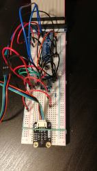
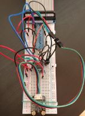

# UV IoT Device

Project to make a battery powered IoT device for the measurement of UV radiation, temperature and visible light levels.

### Software Requirements

- Python>=3.7
- RPi.GPIO>=0.7
- gpiozero>=1.5
- numpy>= 1.16
- DFRobot_VEML6075.py library for UV sensor (https://github.com/DFRobot/DFRobot_VEML6075)
- ADCDevice-1.0.2 library for PCF8591 (https://github.com/Freenove/Freenove_Super_Starter_Kit_for_Raspberry_Pi/tree/master/Libs/Python-Libs)

### Hardware Requirements

- Raspberry Pi Zero W
- Thermistor
- Photoresistor
- PCF8591 (or another ADC)
- 5000 or 10000 mAh powerbank
- VEML6075 UV sensor

### Prototype v1.1

**v1.1 set up on the Breadboard**

### Software v1.1- Python

**IoT Recordings**

Program to record temperature, light levels, UVA, UVB and UVindex every 10s and dump these into a json file every minute :

> python/v1.1/RPiIoTmain.py

Can be run as a start-up script using:

> startupBash.sh

### Prototype Device v1.0

**Initial set up of the device Prototype on the Breadboard**

### Software v1.0- Python

**IoT UV/temp recorder**

Program to record temperature, UVA, UVB and UVindex every 10s and dump these into a json file every minute can be done by adding the following to the Raspberry Pi startup scripts for running after boot:

> startupBash.sh

Python script run by startupBash:

> python/v1.0/RPiUVmeasureMain.py

**Temp and UV print to terminal**

> python/RPiUVmain.py

**Shutdown button**

> python/shutdownSwitch/RPiButtonShutdown.py

> python/shutdownSwitch/RPiTempShutdown.py

(with temperature measurement)

### Software- julia
